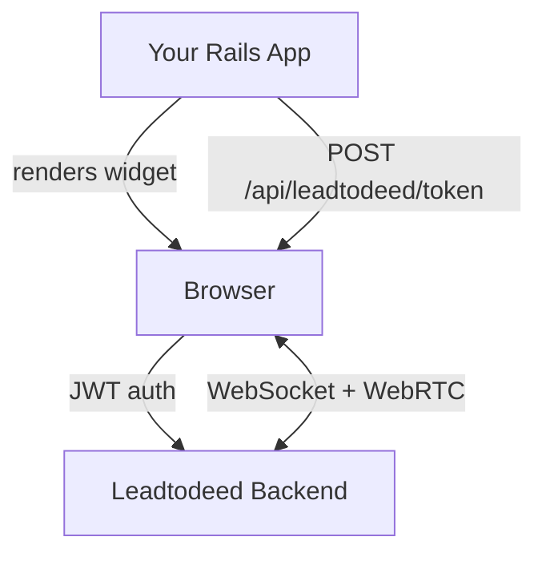

# Leadtodeed Rails

Drop-in Rails engine that adds browser-based phone calls (WebRTC) to your app. Users can make and receive calls right from the browser — no plugins, no downloads.

## Requirements

- Ruby >= 3.2, Rails >= 7.0
- [importmap-rails](https://github.com/rails/importmap-rails) + [Stimulus](https://stimulus.hotwired.dev/)
- An auth system with `current_user` and `authenticate_user!` (e.g. [Devise](https://github.com/heartcombo/devise))

## Setup

Add the gem and bundle:

```ruby
gem "leadtodeed-rails"
```

Set the environment variables:

- `LEADTODEED_JWT_SECRET` — secret for signing JWT tokens
- `LEADTODEED_BACKEND_URL` — your backend URL (e.g. `https://your-tenant.leadtodeed.ai`)
- `LEADTODEED_PRIMARY_COLOR` — widget accent color, hex (optional, defaults to `#8B5CF6`)

Mount the engine in `config/routes.rb`:

```ruby
mount Leadtodeed::Rails::Engine => "/api/leadtodeed"
```

This gives you `POST /api/leadtodeed/token` — returns a short-lived JWT for the current user.

Your `current_user` needs to respond to `email`, `id`, and `name`.

## Usage

Render the widget in your layout:

```slim
body
  = render "leadtodeed/widget"
```

That's it. The widget only shows for signed-in users. Any `<a href="tel:...">` link is automatically intercepted and routed through WebRTC.

### JavaScript API

```javascript
window.leadtodeedCall("+15551234567")

// or directly
window.leadtodeedPhone.call("+15551234567")
window.leadtodeedPhone.answer()
window.leadtodeedPhone.reject()
window.leadtodeedPhone.hangup()
```

### Caller info link

You can show a clickable link in the call popup (e.g. to a CRM record) by defining `window.leadtodeedOnCall`. The widget calls it on incoming calls with the phone number and a `done` callback:

```javascript
window.leadtodeedOnCall = async (phone, done) => {
  try {
    const resp = await fetch(`/clients/search?phone=${encodeURIComponent(phone)}`, {
      credentials: "same-origin",
      headers: { Accept: "application/json" },
    })
    if (!resp.ok) return done(null)
    const data = await resp.json()
    done({ link: data.link, text: data.display_name })
  } catch (e) {
    done(null)
  }
}
```

Pass `{ link, text }` to show a link, or `null` to skip. To wire it up, override the widget partial:

```slim
= leadtodeed_widget_tag
- if user_signed_in?
  div data-controller="leadtodeed leadtodeed-call" style="display:contents"

  javascript:
    window.leadtodeedOnCall = async (phone, done) => {
      try {
        const csrfToken = document.querySelector('meta[name="csrf-token"]')?.content
        const resp = await fetch(`/clients/search?phone=${encodeURIComponent(phone)}`, {
          credentials: 'same-origin',
          headers: { 'X-CSRF-Token': csrfToken, 'Accept': 'application/json' }
        })
        if (!resp.ok) return done(null)
        const data = await resp.json()
        done({ link: data.link, text: data.display_name })
      } catch(e) { done(null) }
    }
```

## Development

```bash
bundle exec rake        # specs + RuboCop
bundle exec rspec       # specs only
bundle exec rubocop     # lint only
```

## How it works


